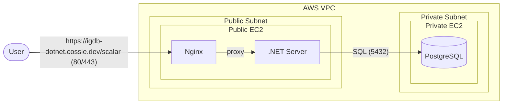

```mermaid 
graph LR
    User([User])

    subgraph AWS_VPC [AWS VPC]
        
        subgraph Public_Subnet [Public Subnet]
            subgraph Public_EC2 [Public EC2]
                Nginx[Nginx]
                DotNet[.NET Server]
            end
        end

        subgraph Private_Subnet [Private Subnet]
            subgraph Private_EC2 [Private EC2]
                PostgreSQL[(PostgreSQL)]
            end
        end
        
    end

    User -- "https://igdb-dotnet.cossie.dev/scalar (80/443)" --> Nginx
    Nginx -- "proxy" --> DotNet
    DotNet -- "SQL (5432)" --> PostgreSQL
```